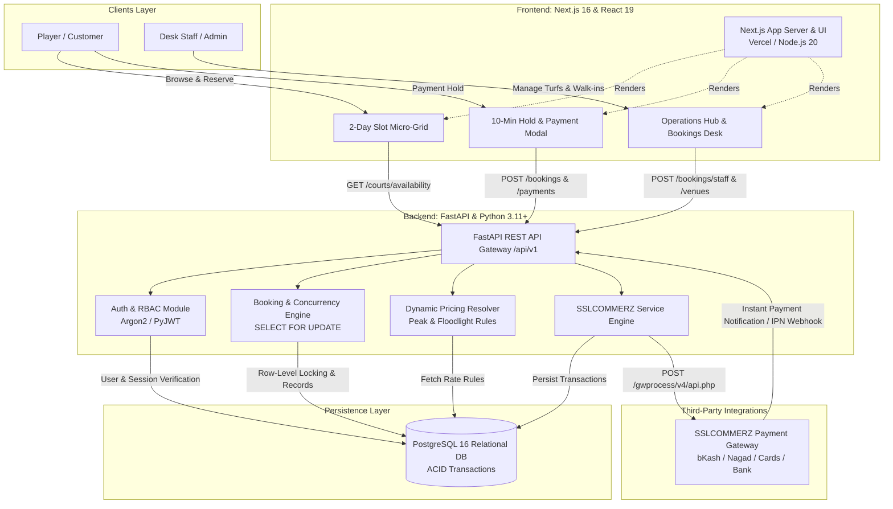
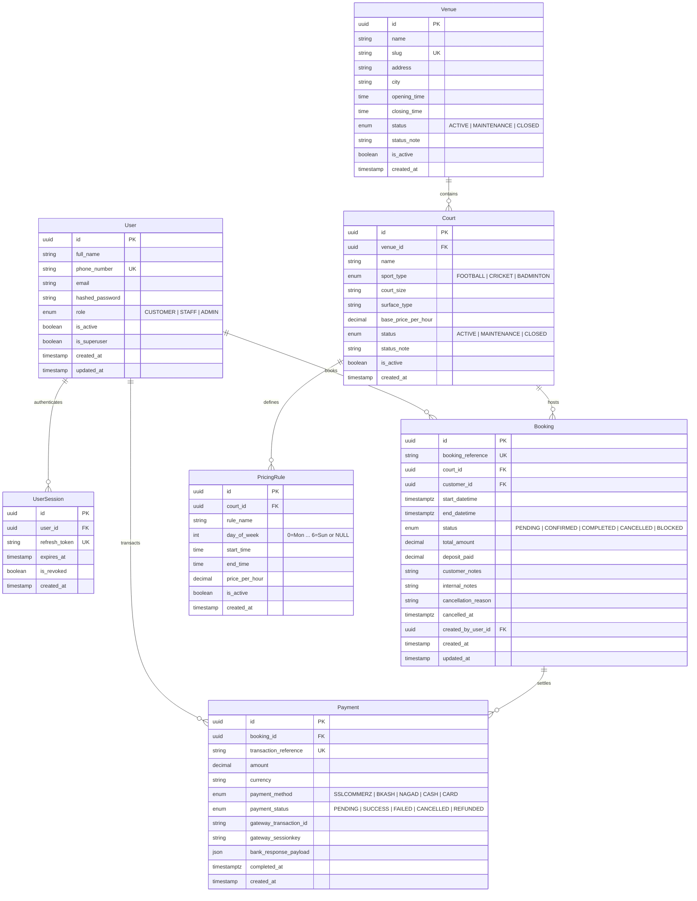
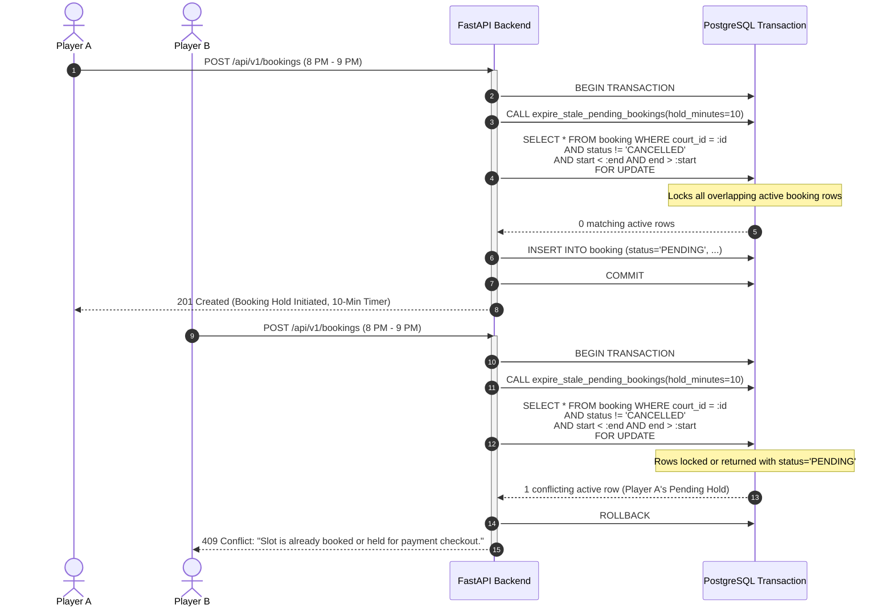
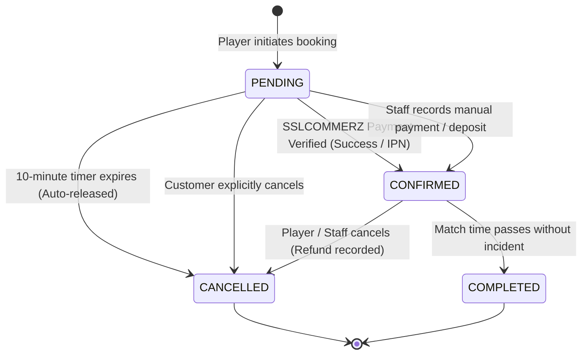
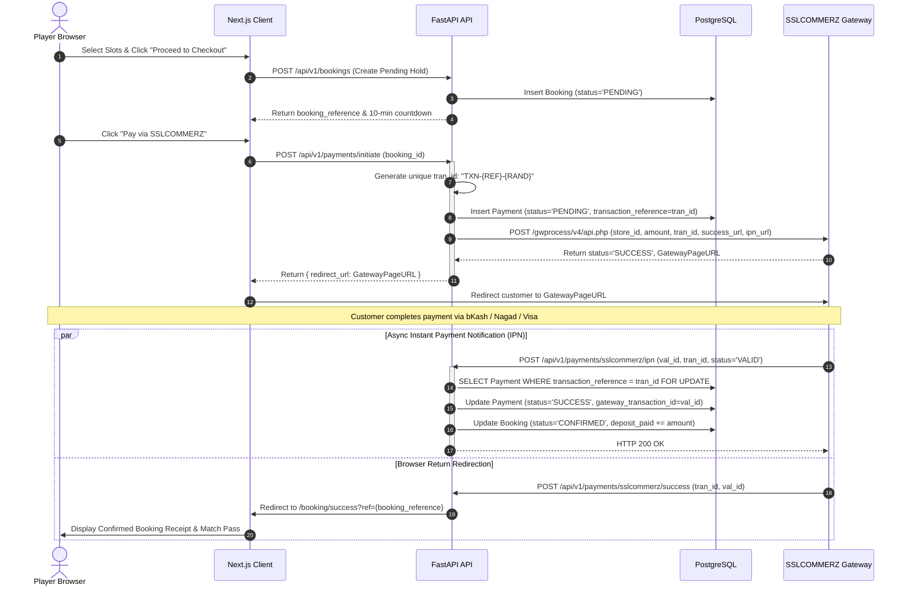
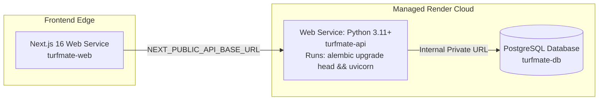

# TurfMate System Architecture 🏟️📐

> **Engineering Architecture, Technical Specification & Design Patterns**  
> Version: 1.0 • Target: Production Monorepo • Timezone: Bangladesh Standard Time (`UTC+06:00`)

---

## 1. Executive Summary & System Overview

**TurfMate** is a specialized sports facility management platform engineered specifically for the operational challenges of football and cricket turfs across Bangladesh. Turf operations present distinct domain requirements that generic booking systems fail to handle:

1. **High Contention During Prime Hours**: Late-afternoon (5:00 PM – 8:00 PM) and floodlight night hours (8:00 PM – 2:00 AM) experience simultaneous booking requests from hundreds of players within seconds.
2. **Continuous 24/7 Operations**: Prominent arenas operate around the clock without artificial daily closing hours.
3. **Cross-Midnight Match Windows**: Many evening bookings span across midnight (e.g., 11:00 PM to 1:00 AM).
4. **Local Payment Ecosystem**: High reliance on domestic mobile financial services (bKash, Nagad, Rocket) and local debit cards processed via SSLCOMMERZ.

TurfMate solves these problems through an asynchronous **FastAPI** backend, transactional **PostgreSQL** row-level locking, a **10-minute hold expiration state machine**, and a **Next.js 16** responsive client interface.

---

## 2. High-Level System Topology



### Component Breakdown

| Layer | Technology | Primary Function |
| :--- | :--- | :--- |
| **Client Frontend** | Next.js 16, React 19, Tailwind CSS v4, Zustand | Reactive booking interface, continuous 2-day availability micro-grid, 10-minute hold countdown timer, responsive operations dashboard. |
| **API Backend** | FastAPI, Uvicorn, Python 3.11+, Pydantic v2 | High-throughput async REST endpoints, request validation, business rules, RBAC enforcement. |
| **ORM & Migrations** | SQLModel (SQLAlchemy 2.0 Core) + Alembic | Declarative schema definitions, relationship queries, migration tracking, database schema versioning. |
| **Relational Database** | PostgreSQL 15/16 | ACID transactional guarantees, row-level pessimistic locking (`SELECT ... FOR UPDATE`), temporal range queries. |
| **Payment Gateway** | SSLCOMMERZ Sandbox / Live API | Multi-channel local payment processing, automated return URL redirection, asynchronous IPN webhooks. |

---

## 3. Database Schema & Entity Relationship Diagram

The database architecture is structured around facilities (`venues`), individual playing surfaces (`courts`), rate structures (`pricing_rules`), reservations (`bookings`), financial settlements (`payments`), and user identity (`users` & `user_sessions`).



### Key Database Design Principles

1. **UUID Primary Keys (`BaseUUIDModel`)**: All entities use RFC 4122 v4 UUIDs generated via Python's `uuid.uuid4()`. This prevents enumeration attacks and facilitates distributed microservice extraction if needed.
2. **Universal UTC Timestamps**: All temporal fields (`start_datetime`, `end_datetime`, `created_at`, `updated_at`, `cancelled_at`) are persisted in PostgreSQL with timezone information (`TIMESTAMPTZ` / `DateTime(timezone=True)`).
3. **Soft Lifecycle & Audit Trails**: Bookings retain state changes, recorded cancellation reasons, and `created_by_user_id` to audit whether a booking was placed directly by the customer or by an on-duty staff member at the desk.

---

## 4. Concurrency Control & Race Condition Prevention

### The Problem: High-Concurrency Double-Booking
When two players attempt to book the same court slot (e.g., Friday 8:00 PM – 9:00 PM) at the same second, typical "read-then-write" validation fails:

```
Player A: SELECT * WHERE court_id=... (Empty -> slot is open)
Player B: SELECT * WHERE court_id=... (Empty -> slot is open)
Player A: INSERT booking (PENDING)
Player B: INSERT booking (PENDING)  <-- DOUBLE BOOKING!
```

### The Solution: Pessimistic Row Locking (`SELECT FOR UPDATE`)

TurfMate implements a two-step concurrency protocol in [`app/services/booking_service.py`](file:///f:/Programs/Full%20Stack/turfmate/backend/app/services/booking_service.py):



### 10-Minute Hold Lifecycle & State Machine



#### Auto-Release Mechanism (`expire_stale_pending_bookings`)
To prevent abandoned checkouts from permanently locking slots:
- Prior to every availability calculation and before every new booking reservation, the system executes:
  ```python
  def expire_stale_pending_bookings(session: Session, hold_minutes: int = 10) -> int:
      cutoff = utc_now() - timedelta(minutes=hold_minutes)
      statement = select(Booking).where(
          Booking.status == BookingStatus.PENDING,
          Booking.created_at < cutoff,
      )
      stale_bookings = list(session.exec(statement).all())
      for b in stale_bookings:
          b.status = BookingStatus.CANCELLED
          b.cancellation_reason = f"Payment session timed out ({hold_minutes}-minute limit exceeded)"
          b.cancelled_at = utc_now()
          session.add(b)
      if stale_bookings:
          session.commit()
      return len(stale_bookings)
  ```
- Any hold older than 10 minutes is automatically marked `CANCELLED`, returning the slot to public availability without requiring cron infrastructure.

---

## 5. Timezone Strategy & 24/7 Scheduling Engine

### The Problem: Multi-Hour Matches & 24/7 Arenas
1. **Timezone Shifts**: Bangladesh Standard Time (`BST`) is fixed at `UTC+06:00`. If UTC timestamps are queried naively against calendar dates, a query for `2026-09-20` in UTC corresponds to `06:00 AM (Sep 20)` through `05:59 AM (Sep 21)` in Bangladesh. This creates a 6-hour offset error where users see slots starting at 6:00 AM rather than 12:00 AM midnight.
2. **Operating Hours Constraints**: Turfs operating 24 hours a day were previously rejected because typical validation expects `open_time < close_time`. When a venue had `00:00:00` to `00:00:00`, standard range checks evaluated the operational window as zero seconds, rejecting early morning bookings (e.g., 1:00 AM to 3:00 AM).

### Architectural Solution

#### 1. The Canonical 24/7 Venue Contract
A venue is designated as **24/7 continuous operation** if and only if:
```python
def is_venue_24_hours(venue: Venue) -> bool:
    return venue.opening_time == venue.closing_time
```
- In [`app/services/booking_service.py`](file:///f:/Programs/Full%20Stack/turfmate/backend/app/services/booking_service.py), when `is_venue_24_hours(venue)` evaluates to `True`, the operating hours validation is **completely bypassed**.
- Players and staff can book any hour of the day (e.g., 12:00 AM – 3:00 AM) without rejection.

#### 2. Local Calendar Day Translation
When a client requests availability for date $D$ (e.g., `2026-09-20`):
1. Construct start of day in Bangladesh local time:  
   `day_start_local = datetime.combine(D, 00:00:00).replace(tzinfo=VENUE_TIMEZONE)`
2. Construct end of day in Bangladesh local time:  
   `day_end_local = datetime.combine(D + 1 day, 00:00:00).replace(tzinfo=VENUE_TIMEZONE)`
3. Convert both to UTC before filtering PostgreSQL:
   ```python
   day_start_utc = day_start_local.astimezone(timezone.utc) # 2026-09-19 18:00:00 UTC
   day_end_utc   = day_end_local.astimezone(timezone.utc)   # 2026-09-20 18:00:00 UTC
   ```
4. Availability slots iterate starting from `00:00` (12:00 AM) to `23:00` (11:00 PM) in local time, giving a clean 24-hour visual grid.

#### 3. Cross-Midnight Booking Support
Because bookings take absolute UTC timestamps (`start_datetime` and `end_datetime`), a booking from `2026-09-20 23:00:00+06:00` to `2026-09-21 01:00:00+06:00` is stored as a single continuous reservation. The frontend availability grid renders both days concurrently, allowing the user to select contiguous slots spanning across the midnight boundary.

---

## 6. Dynamic Pricing Calculation Engine

Turf rates fluctuate significantly based on artificial lighting (floodlights) and peak weekend demand (Friday / Saturday).

### Pricing Priority Hierarchy
When calculating the price for any 30-minute interval within a match window, the pricing service [`app/services/pricing_service.py`](file:///f:/Programs/Full%20Stack/turfmate/backend/app/services/pricing_service.py) applies the following rule precedence:

```mermaid
flowchart TD
    Start([Calculate Slot Price for time T]) --> Rule1{Is there an active rule<br/>where day_of_week == T.weekday<br/>AND T is within [start_time, end_time)?}
    
    Rule1 -- YES --> ApplyDayRule[Apply Day-Specific Price<br/>e.g., Friday Afternoon Peak]
    
    Rule1 -- NO --> Rule2{Is there an active rule<br/>where day_of_week is NULL<br/>AND T is within [start_time, end_time)?}
    
    Rule2 -- YES --> ApplyGeneralRule[Apply General Time Window Price<br/>e.g., Daily Floodlight Rate]
    
    Rule2 -- NO --> FallbackCourt[Apply Court Base Price<br/>court.base_price_per_hour]

    ApplyDayRule --> End([Return Rate])
    ApplyGeneralRule --> End
    FallbackCourt --> End
```

### Time-Window Boundary Matching
Rules handle both intra-day windows (e.g. `18:00` to `23:00`) and midnight-crossing windows (e.g. `22:00` to `04:00`):
```python
def _matches_rule_time(rule: PricingRule, check_time: time) -> bool:
    if rule.end_time == time(0, 0):
        return rule.start_time <= check_time
    if rule.start_time < rule.end_time:
        return rule.start_time <= check_time < rule.end_time
    # Handles wrap-around midnight rules (e.g., 10 PM to 4 AM)
    return rule.start_time <= check_time or check_time < rule.end_time
```

---

## 7. Payment Integration & Webhook Lifecycle (SSLCOMMERZ)

TurfMate integrates with **SSLCOMMERZ**, Bangladesh's largest payment gateway aggregator.



### Webhook Idempotency & Fault Tolerance
Because SSLCOMMERZ sends both a browser POST return (`success_url`) and an asynchronous server-to-server webhook (`ipn_url`), the backend is strictly idempotent:
- Checking `payment.payment_status == PaymentStatus.SUCCESS` prevents duplicate crediting of `deposit_paid`.
- If a customer closes their mobile browser after entering their bKash PIN, the IPN webhook guarantees the booking transitions to `CONFIRMED` in the background.

---

## 8. Authentication & Role-Based Access Control (RBAC)

TurfMate implements a JWT-based authentication system with dual-token architecture (short-lived access tokens, long-lived refresh tokens) and role permissions:

### User Roles

| Role | Target Audience | Permissions & Scope |
| :--- | :--- | :--- |
| `CUSTOMER` | General Players | Browse availability, reserve slots, initiate online payments, cancel own pending/confirmed bookings, view match history. |
| `STAFF` | Front-Desk Turf Operators | All Customer permissions + Bookings Desk, manual walk-in phone bookings, cash payment registration, check-in mark, maintenance toggling. |
| `ADMIN` / `SUPERUSER` | Facility Owners & Superusers | All Staff permissions + Venue settings, court creation/updates, dynamic pricing rule manager, staff account administration, revenue telemetry. |

### Security Mechanisms
1. **Password Hashing**: Passwords are hashed using the **Argon2id** algorithm (`passlib[argon2]`), resistant to GPU-based brute force attacks.
2. **Access Tokens**: Encoded as HS256 JWTs containing `sub` (User UUID), `phone`, and `role`. Lifespan: **60 minutes**.
3. **Refresh Tokens**: Persisted in the `user_sessions` table with an explicit `expires_at` timestamp (30 days) and `is_revoked` flag, enabling administrative session revocation upon logout or account compromise.

---

## 9. Frontend Architecture & Design System

The frontend application in `frontend/` is built on **Next.js 16 (Turbopack)** using the React 19 App Router.

```
frontend/
├── app/
│   ├── layout.tsx             # Root layout with responsive Navbar and Footer
│   ├── page.tsx               # High-converting Landing page with 2-day live slot grid
│   ├── login/                 # Phone/password authentication
│   ├── register/              # New player registration
│   ├── dashboard/             # Player portal (Active matches, past history)
│   ├── admin/page.tsx         # Operations Hub (Bookings Desk, Pitches, Dynamic Pricing)
│   └── booking/               # SSLCOMMERZ redirect return handlers
├── components/
│   ├── SlotAvailabilityPreview.tsx # 2-day micro-grid slot selector
│   ├── BookingHoldPaymentModal.tsx # 10-minute hold countdown timer & SSLCOMMERZ trigger
│   ├── admin/
│   │   ├── BookingsDesk.tsx   # Live reservation management table & walk-in creator
│   │   ├── VenuePitchManager.tsx # Court dimensions, surface, maintenance status
│   │   └── PricingRuleManager.tsx # Dynamic hourly rate rules manager
│   ├── Navbar.tsx             # Dynamic navigation based on auth state
│   └── Footer.tsx
├── lib/
│   ├── api.ts                 # Axios instance with auto-bearer auth & 401 refresh interceptors
│   └── auth-store.ts          # Zustand store with persistent localStorage hydration
└── types/index.ts             # TypeScript definitions aligned with backend Pydantic schemas
```

### Key UI/UX Innovations
- **Two-Day Horizon View**: Renders today and tomorrow side-by-side in a space-optimized 2-column micro-grid.
- **Micro-Grid Visual Cues**:
  - 🟢 **Emerald**: Available for booking with dynamic price tag.
  - 🟡 **Amber**: Pending payment hold (displays 10-minute hold note).
  - 🔴 **Rose**: Confirmed reservation.
  - 🔘 **Zinc**: Court maintenance or facility closure.
- **Tailwind CSS v4 Clean Palette**: Uses strict token scales (`zinc-100` through `zinc-900`) ensuring high-contrast visibility across light and dark operating modes without styling glitches.

---

## 10. Deployment Topology & Production Specification

TurfMate is configured for deployment on modern cloud platforms (Render, Railway, or AWS ECS) using the included [`render.yaml`](file:///f:/Programs/Full%20Stack/turfmate/render.yaml) specification:



### Deployment Configuration Checklist
1. **Migrations First**: Backend service pre-deploy command runs `alembic upgrade head` before starting `uvicorn`.
2. **CORS Enforcement**: Set `BACKEND_CORS_ORIGINS` to the exact production frontend domains (e.g., `https://turfmate.vercel.app`).
3. **Timezone Offset**: Ensure `VENUE_TIMEZONE_OFFSET_HOURS=6` is configured in production environment variables.
4. **SSLCOMMERZ Live Credentials**: Switch `SSLCOMMERZ_IS_SANDBOX=False` and supply production `SSLCOMMERZ_STORE_ID` and `SSLCOMMERZ_STORE_PASS`.
